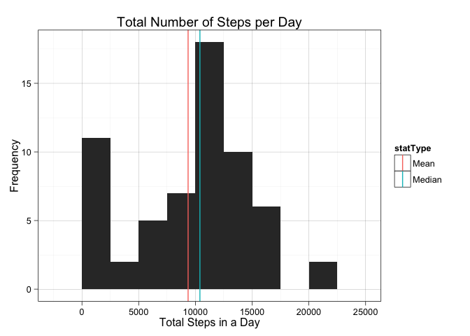
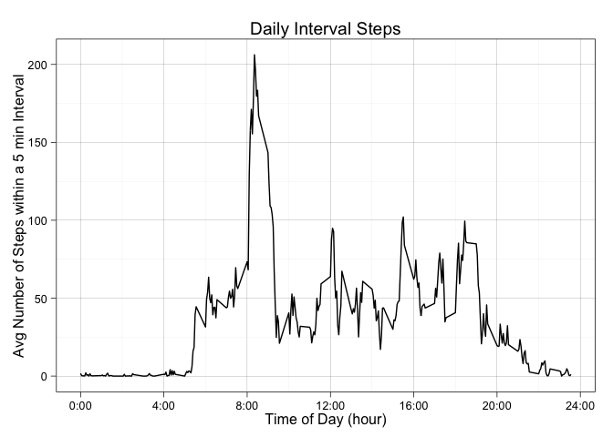
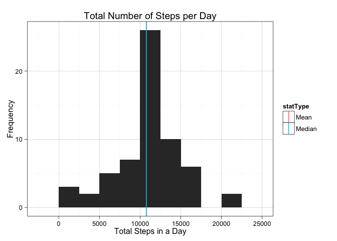
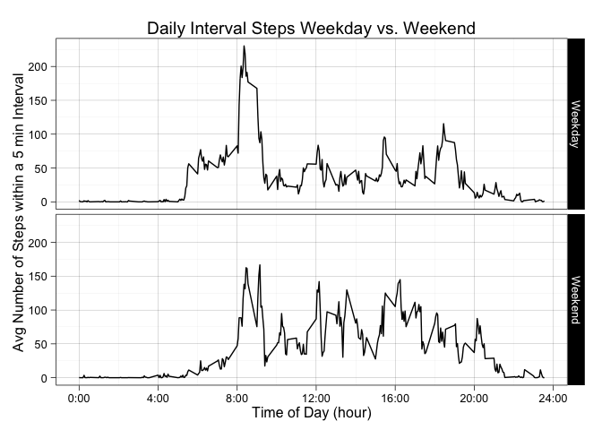

# Reproducible Research: Peer Assessment 1

## Loading and preprocessing the data
#### Show any code that is needed to:
##### 1. Load the data (i.e. read.csv())
##### 2. Process/transform the data (if necessary) into a format suitable for your analysis

```r
# unzip the data file and load it into a data frame
unzip( "activity.zip" )
data <- read.csv( "activity.csv", header=TRUE )
```

## What is mean total number of steps taken per day?
#### For this part of the assignment, you can ignore the missing values in the dataset.
##### 1. Make a histogram of the total number of steps taken each day
##### 2. Calculate and report the mean and median total number of steps taken per day

```r
# sum the number of steps per day
totalStepsByDay <- as.data.frame( tapply( data$steps, data$date, sum, na.rm=TRUE ))
colnames( totalStepsByDay ) <- "steps"

# calculate the mean and median total number of steps taken per day
meanSteps <- mean( totalStepsByDay$steps )
medianSteps <- median( totalStepsByDay$steps )

## plot a histogram of the number of steps
library("ggplot2")
g <- ggplot( totalStepsByDay, aes( x=steps ))
g <- g + geom_histogram( bin=2500 )
g <- g + labs( title="Total Number of Steps per Day", y="Frequency", 
               x="Total Steps in a Day" )
vLines <- data.frame( statType=c("Mean", "Median"), vals=c( meanSteps, medianSteps ))
g <- g + geom_vline( data = vLines, aes( xintercept=vals, colour=statType ), show_guide = TRUE )
g <- g + theme_linedraw( base_size = 12, base_family = "" )
print( g )
```

 


```
## [1] "The mean number of steps: 9354.23."
```

```
## [1] "The median number of steps: 10395."
```

## What is the average daily activity pattern?
##### 1. Make a time series plot (i.e. type = "l") of the 5-minute interval (x-axis) and the average number of steps taken, averaged across all days (y-axis).
##### 2. Which 5-minute interval, on average across all the days in the dataset, contains the maximum number of steps?

```r
## Calculate the average steps per interval.
meanStepsPerInt <- tapply( data$steps, data$interval, mean, na.rm=TRUE )
interval <- as.numeric( names( meanStepsPerInt ) )

meanStepsPerIntDf <- data.frame( interval, meanStepsPerInt )
##g <- ggplot( meanStepsPerIntDf, aes( x=interval, y=meanStepsPerInt ))
g <- ggplot( meanStepsPerIntDf, aes( interval/100, meanStepsPerInt ))
g <- g + geom_line()
g <- g + labs( title="Daily Interval Steps", x="Time of Day (hour)", y="Avg Number of Steps within a 5 min Interval" ) 
g <- g + scale_x_continuous( breaks=0:6*4, labels=paste(0:6*4,":00", sep="" ))
g <- g + theme_linedraw( base_size = 12, base_family = "" )
print( g )
```

 

```r
# Which 5-minute interval, on average across all the days in the dataset, contains the maximum number of steps?
maxNumSteps <- which( meanStepsPerInt==max( meanStepsPerInt ) )
maxNumStepsPerInt <- data$interval[ maxNumSteps ]
```

```
## [1] "Max number of steps interval of the day: 08:35"
```

## Imputing missing values
#### Note that there are a number of days/intervals where there are missing values (coded as NA). The presence of missing days may introduce bias into some calculations or summaries of the data.
##### 1. Calculate and report the total number of missing values in the dataset (i.e. the total number of rows with NAs).
##### 2. Devise a strategy for filling in all of the missing values in the dataset. The strategy does not need to be sophisticated. For example, you could use the mean/median for that day, or the mean for that 5-minute interval, etc.
##### 3. Create a new dataset that is equal to the original dataset but with the missing data filled in.
##### 4. Make a histogram of the total number of steps taken each day and Calculate and report the mean and median total number of steps taken per day. Do these values differ from the estimates from the first part of the assignment? What is the impact of imputing missing data on the estimates of the total daily number of steps?

```r
# Calculate the total number of missing values in the dataset (i.e. the total number of rows with NAs).
## subset with rows that have NAs
dataRowsNa <- data[ !complete.cases( data), ]
## number of rows with NAs
numDataRowsNas <- nrow( dataRowsNa )
```

```
## [1] "The number of rows with NAs: 2304"
```

##### For the missing interval step data (NAs), we will replace with the mean number of steps for the interval as it was calculated above.

```r
# Fill in the missing interval step data with the interval mean value calculate above
for ( i in 1:nrow( data )){
  if ( is.na( data$steps[i] )){
    intervalVal <- data$interval[i]
    rowId <- which( meanStepsPerIntDf$interval == intervalVal )
    stepsVal <- meanStepsPerIntDf$meanStepsPerInt[rowId]
    data$steps[i] <- stepsVal
  }
}

# sum the number of steps per day with the mean modified data frame
totalStepsByDayMeanMod <- as.data.frame( tapply( data$steps, data$date, sum, na.rm=TRUE ))
colnames( totalStepsByDayMeanMod ) <- "steps"

# calculate the mean and median total number of steps taken per day with the mean modified data
meanStepsMeanMod <- mean( totalStepsByDayMeanMod$steps )
medianStepsMeanMod <- median( totalStepsByDayMeanMod$steps )

## plot a histogram of the number of steps
library("ggplot2")
g <- ggplot( totalStepsByDayMeanMod, aes( x=steps ))
g <- g + geom_histogram( bin=2500 )
g <- g + labs( title="Total Number of Steps per Day" )
g <- g + labs( y="Frequency", x="Total Steps in a Day" )
vLines <- data.frame( statType=c("Mean", "Median"), vals=c( meanStepsMeanMod, medianStepsMeanMod ))
g <- g + theme_linedraw( base_size = 12, base_family = "" )
g <- g + geom_vline( data = vLines, aes( xintercept=vals, colour=statType ), show_guide=TRUE )
print( g )
```

 


```
## [1] "The mean number of steps with the unmodified data is: 9354.23."
```

```
## [1] "The median number of steps with the unmodified data is: 10395."
```

```
## [1] "The mean number of steps with the mean modfied data: 10766.19."
```

```
## [1] "The median number of steps with the mean modified data: 10766."
```

## Are there differences in activity patterns between weekdays and weekends?
#### For this part the weekdays() function may be of some help here. Use the dataset with the filled-in missing values for this part.
##### 1. Create a new factor variable in the dataset with two levels – “weekday” and “weekend” indicating whether a given date is a weekday or weekend day.
##### 2. Make a panel plot containing a time series plot (i.e. type = "l") of the 5-minute interval (x-axis) and the average number of steps taken, averaged across all weekday days or weekend days (y-axis). See the README file in the GitHub repository to see an example of what this plot should look like using simulated data.


```r
# Add a new variable that indicates if the date is on the weekend or a weekday.
dayType <-factor( weekdays(strptime( data$date, "%Y-%m-%d" )) %in% c("Saturday","Sunday"), labels=c("Weekday","Weekend"), ordered=FALSE )
data$dayType <- dayType 

# Aggreagate the data by interval and day type.
meanIntStepsByDayType = aggregate( data$steps, by=list(interval=data$interval, dayType=data$dayType), mean )

# plot the results
library( ggplot2 )
g <- ggplot( meanIntStepsByDayType, aes( interval/100, x ))
g <- g + geom_line() + facet_grid( dayType ~ . )
g <- g + labs( title="Daily Interval Steps Weekday vs. Weekend" )
g <- g + labs( x="Time of Day (hour)", y="Avg Number of Steps within a 5 min Interval" ) 
g <- g + theme_linedraw( base_size = 12, base_family = "" )
g <- g + scale_x_continuous( breaks=0:6*4, labels=paste(0:6*4,":00", sep="" ))
print(g)
```

 
